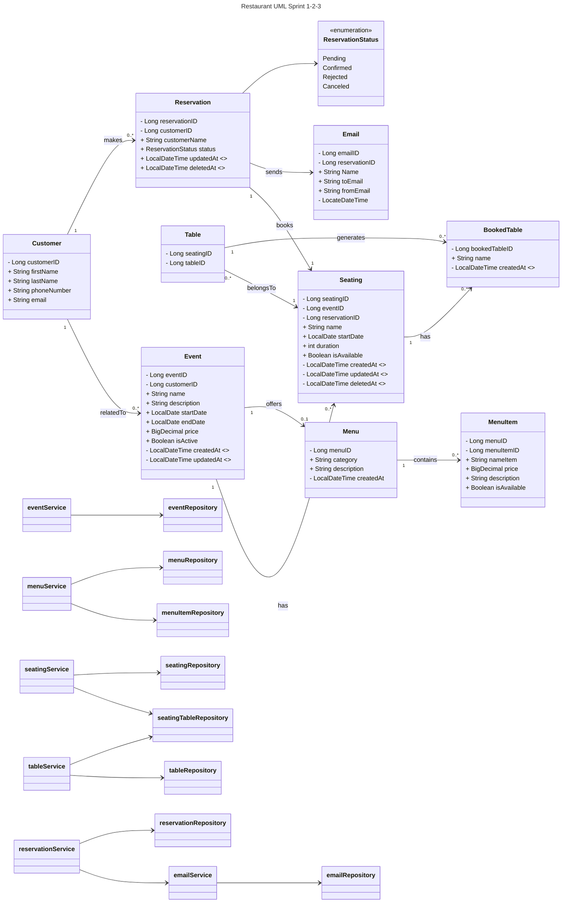

```mermaid
---
title: Restaurant UML Sprint 1-2-3
---
classDiagram
    direction LR

    class Event {
        - Long eventID
        - Long customerID
        + String name
        + String description
        + LocalDate startDate
        + LocalDate endDate
        + BigDecimal price
        + Boolean isActive
        - LocalDateTime createdAt  <<admin>>
        - LocalDateTime updatedAt  <<admin>>
    }

    class Seating{
        - Long seatingID
        - Long eventID
        - Long reservationID
        + String name
        + LocalDate startDate
        + int duration
        + Boolean isAvailable
        - LocalDateTime createdAt  <<admin>>
        - LocalDateTime updatedAt  <<admin>>
        - LocalDateTime deletedAt  <<admin>>
    }

    class Table{
        - Long seatingID
        - Long tableID
    }

    class Customer{
        - Long customerID
        + String firstName
        + String lastName
        + String phoneNumber
        + String email
    }

    class BookedTable{
        - Long bookedTableID
        + String name
        - LocalDateTime createdAt  <<admin>>
    }

    class Menu{
        - Long menuID
        + String category
        + String description
        - LocalDateTime createdAt
    }

    class MenuItem{
        - Long menuID
        - Long menuItemID
        + String nameItem
        + BigDecimal price
        + String description
        + Boolean isAvailable
    }

    class Reservation{
        - Long reservationID
        - Long customerID
        + String customerName
        + ReservationStatus status
        + LocalDateTime updatedAt  <<admin>>
        + LocalDateTime deletedAt  <<admin>>
    }

    class Email{
        - Long emailID
        - Long reservationID
        + String Name
        + String toEmail
        + String fromEmail
        - LocateDateTime
    }
    
    class ReservationStatus{
        <<enumeration>>
        Pending
        Confirmed
        Rejected
        Canceled
    }
    
    class eventService
    class eventRepository
    class seatingService
    class seatingRepository
    class menuService
    class menuItemRepository
    class menuRepository
    class seatingTableRepository
    class tableService
    class tableRepository
    class reservationService
    class reservationRepository
    class emailService
    class emailRepository
    
    reservationService --> emailService
    emailService --> emailRepository
    reservationService --> reservationRepository
    tableService --> tableRepository
    tableService --> seatingTableRepository
    seatingService --> seatingTableRepository
    eventService --> eventRepository
    seatingService --> seatingRepository
    menuService --> menuItemRepository
    menuService --> menuRepository

    Event "1" --> "0..*" Seating : has
    Table "0..*" --> "1" Seating : belongsTo
    Customer "1" --> "0..*" Event : relatedTo
    Table "1" --> "0..*" BookedTable : generates
    Seating "1" --> "0..*" BookedTable : has
    Event "1" --> "0..1" Menu : offers
    Menu "1" --> "0..*" MenuItem : contains
    Customer "1" --> "0..*" Reservation : makes
    Reservation "1" --> "1" Seating : books
    Reservation --> Email : sends
    Reservation --> ReservationStatus
```

