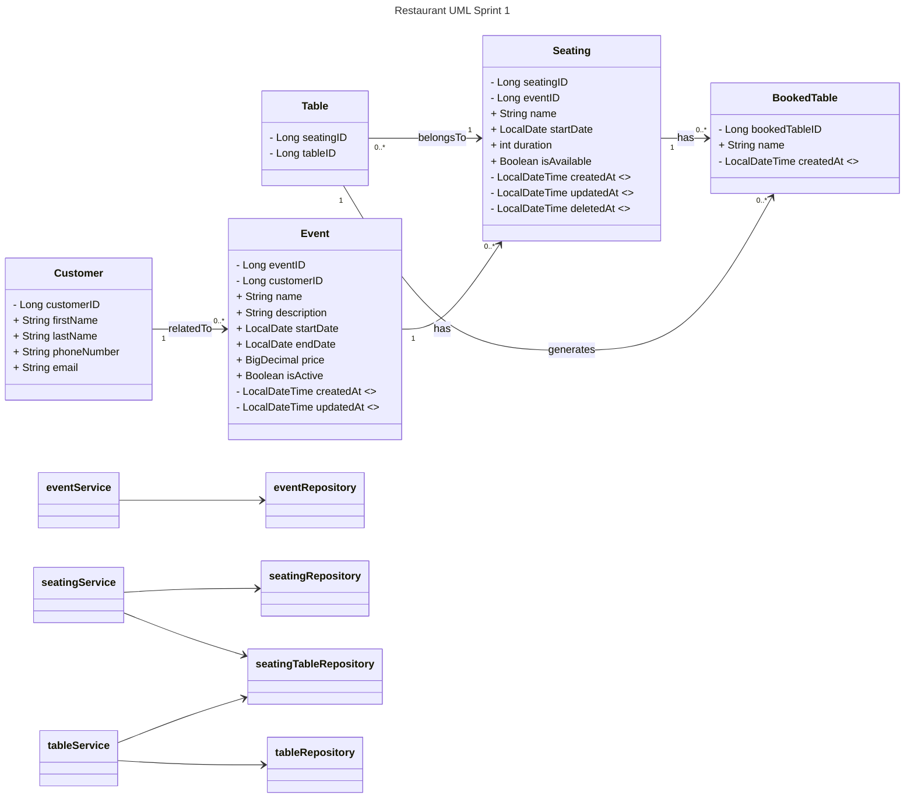

```mermaid
---
title: Restaurant UML Sprint 1
---
classDiagram
    direction LR

    class Event {
        - Long eventID
        - Long customerID
        + String name
        + String description
        + LocalDate startDate
        + LocalDate endDate
        + BigDecimal price
        + Boolean isActive
        - LocalDateTime createdAt  <<admin>>
        - LocalDateTime updatedAt  <<admin>>
    }

    class Seating{
        - Long seatingID
        - Long eventID
        + String name
        + LocalDate startDate
        + int duration
        + Boolean isAvailable
        - LocalDateTime createdAt  <<admin>>
        - LocalDateTime updatedAt  <<admin>>
        - LocalDateTime deletedAt  <<admin>>
    }

    class Table{
        - Long seatingID
        - Long tableID
    }

    class Customer{
        - Long customerID
        + String firstName
        + String lastName
        + String phoneNumber
        + String email
    }

    class BookedTable{
        - Long bookedTableID
        + String name
        - LocalDateTime createdAt  <<admin>>
    }

    class eventService
    class eventRepository
    class seatingService
    class seatingRepository
    class seatingTableRepository
    class tableService
    class tableRepository

%% Service/Repository dependencies 
    tableService --> tableRepository
    tableService --> seatingTableRepository
    seatingService --> seatingTableRepository
    eventService --> eventRepository
    seatingService --> seatingRepository

%% Domain relationships
    Event "1" --> "0..*" Seating : has
    Table "0..*" --> "1" Seating : belongsTo
    Customer "1" --> "0..*" Event : relatedTo
    Table "1" --> "0..*" BookedTable : generates
    Seating "1" --> "0..*" BookedTable : has
```

